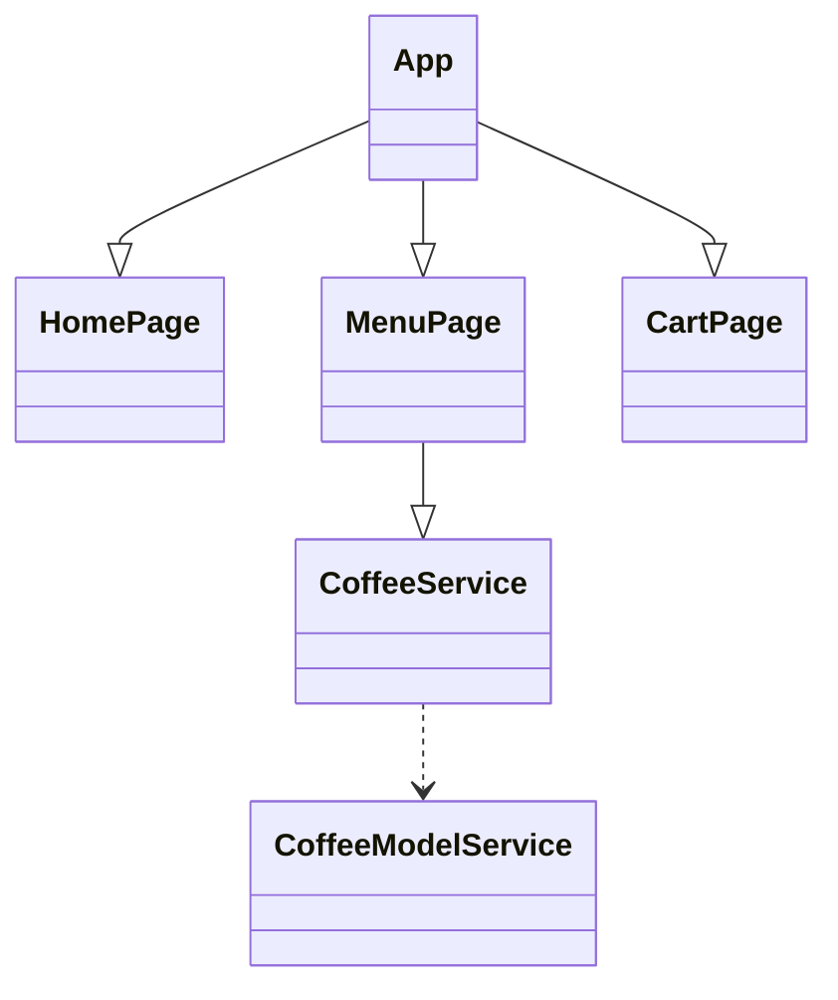
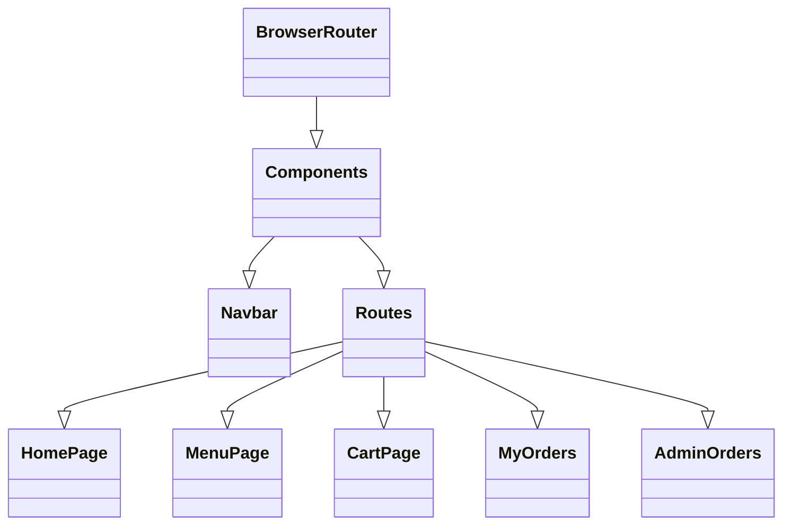

## Component Tree Diagram


## Component Tree Diagram

## Component Tree Diagram
```mermaid
classDiagram
    Components <|-- ProtectedRoute
    Components <|-- PublicRoute
    Components <|-- AdminRoute

    ProtectedRoute --> isAuthenticated
    PublicRoute --> isAuthenticated
    AdminRoute --> isAdmin

    ProtectedRoute <|-- CartPage
    ProtectedRoute <|-- MyOrders

    AdminRoute <|-- AdminOrders

    PublicRoute <|-- AuthModule
    AuthModule <|-- AuthLogin
    AuthModule <|-- AuthRegister
    AuthModule <|-- AuthNav
