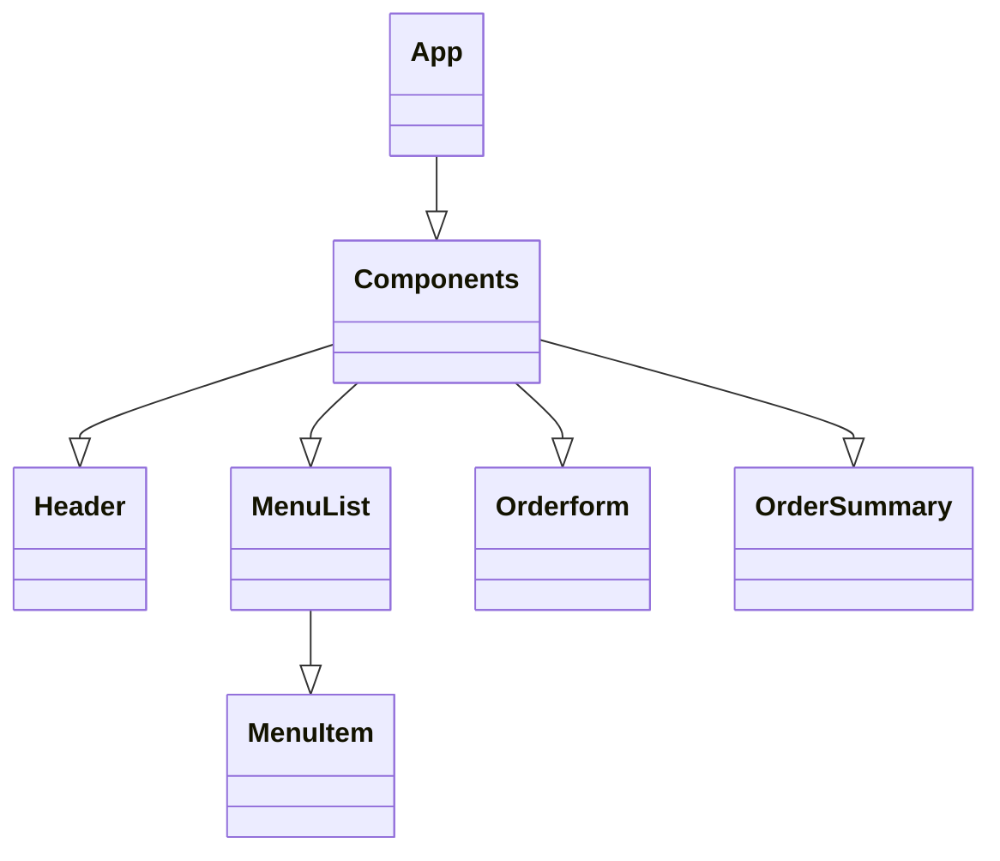
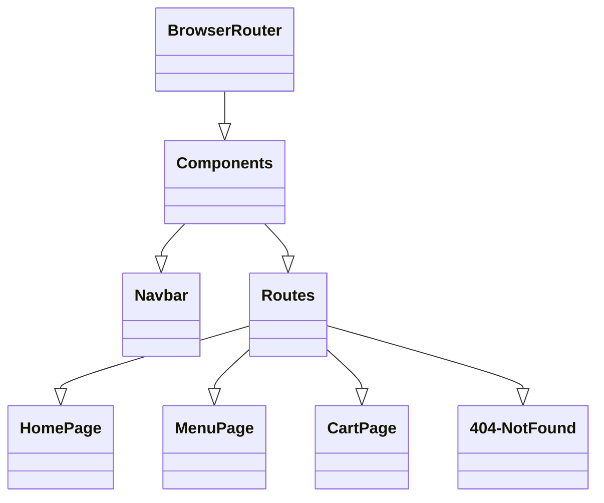
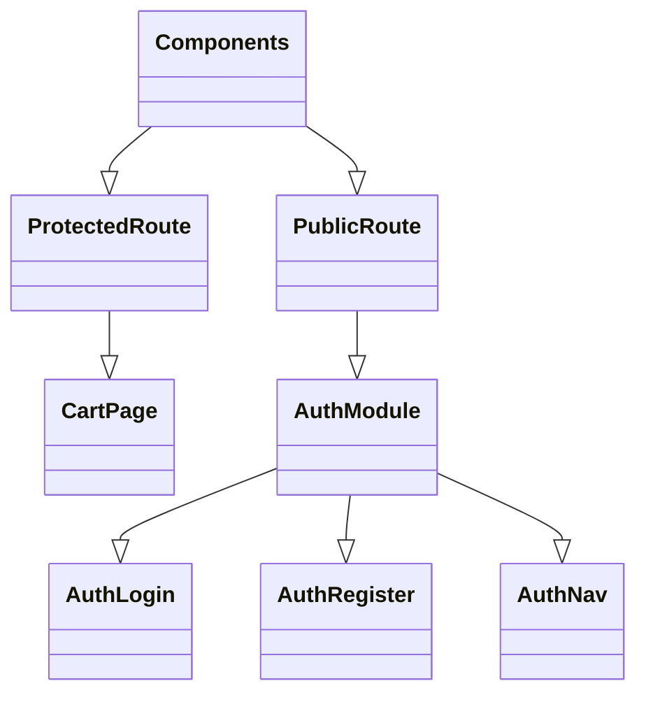
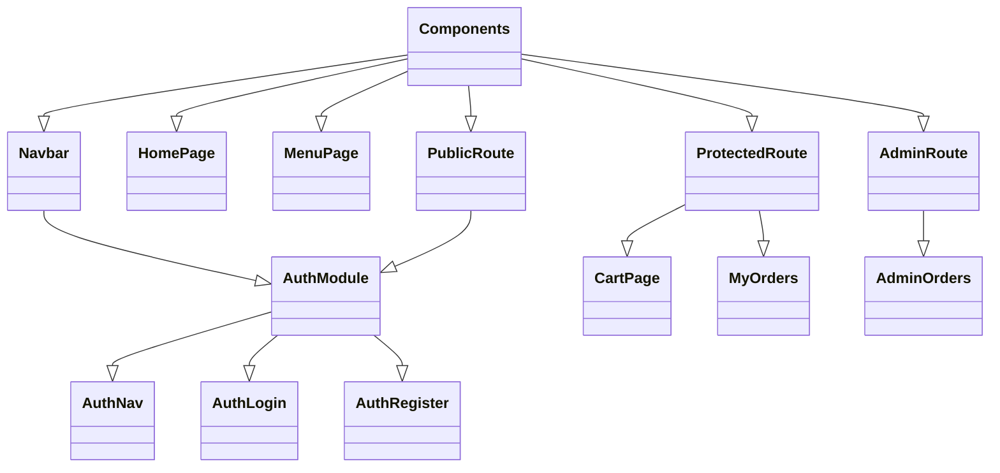

## UML

```mermaid
classDiagram
    %% Core Coffee model (Feature 3)
    class Coffee {
      +id: String
      +name: String
      +description: String
      +price: Number
      +imageUrl: String
    }

    %% Cart & Order added (Feature 4)
    class Item {
      +coffeeId: String
      +quantity: Number
    }
    class Cart {
      +id: String
      +items: Item[]
    }
    class Order {
      +id: String
      +items: Item[]
      +status: String
      +createdAt: Date
    }

    %% Authentication & Roles added (Feature 5)
    class User {
      +id: String
      +username: String
      +email: String
      +firstName: String
      +lastName: String
    }
    class Role {
      +name: String
    }

    %% Relationships
    Cart "1" o-- "*" Item    : contains
    Order "1" o-- "*" Item   : contains
    Item "*" --> "1" Coffee  : references
    Cart "1" --> "1" User    : belongsTo
    Order "*" --> "1" User   : belongsTo
    User "*" -- "*" Role     : assigned

```

## Component Tree Diagram


## Component Tree Diagram

## Component Tree Diagram

## Component Tree Diagram

## Component Tree Diagram
```mermaid
classDiagram
    class User {
        +objectId: string
        +username: string
        +firstName: string
        +lastName: string
        +email: string
    }
    class Cart {
        +objectId: string
        +items: CartItem[]
    }
    class Order {
        +objectId: string
        +items: OrderItem[]
        +status: string
    }
    class Coffee {
        +objectId: string
        +name: string
        +description: string
        +price: number
        +imageUrl: string
    }
    class CartItem {
        +coffeeId: string
        +quantity: number
    }
    class OrderItem {
        +coffeeId: string
        +quantity: number
    }
    class Review {
        +objectId: string
        +rating: number
        +text: string
    }

    User "1" -- "0..1" Cart : owns
    User "1" -- "*" Order : places
    Cart "1" o-- "*" CartItem : contains
    Order "1" o-- "*" OrderItem : contains
    CartItem --> Coffee : refersTo
    OrderItem --> Coffee : refersTo
    Coffee "1" -- "*" Review : has

