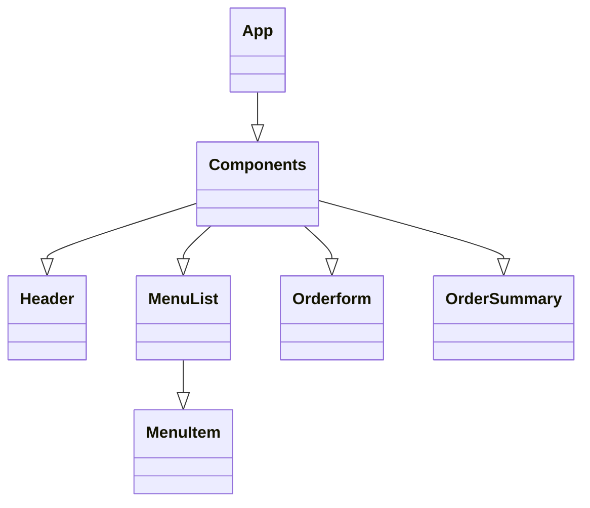
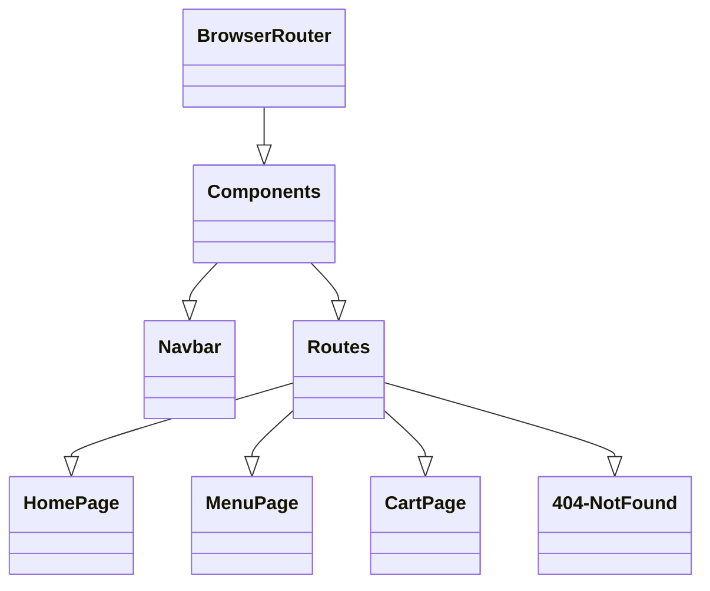
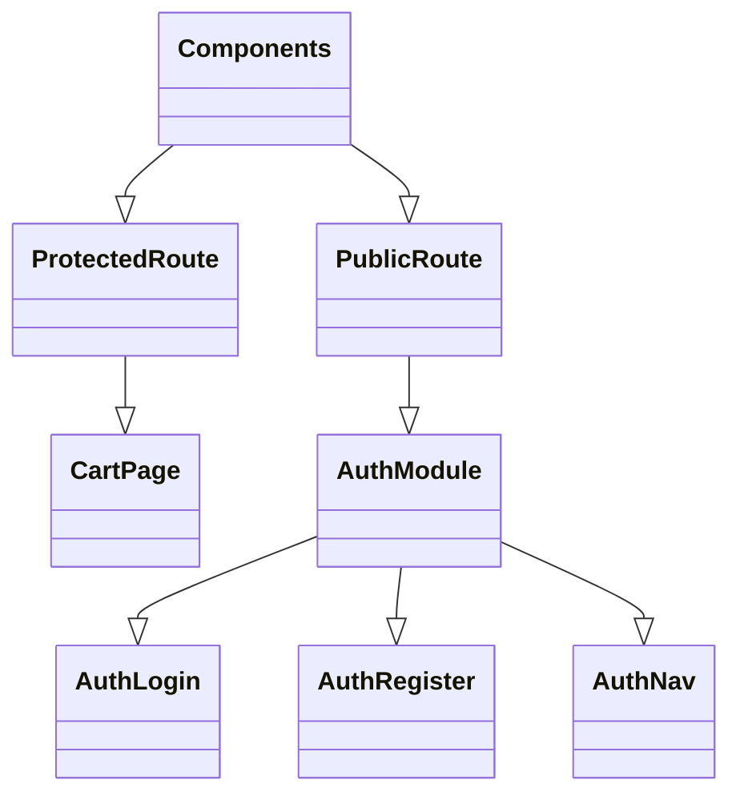
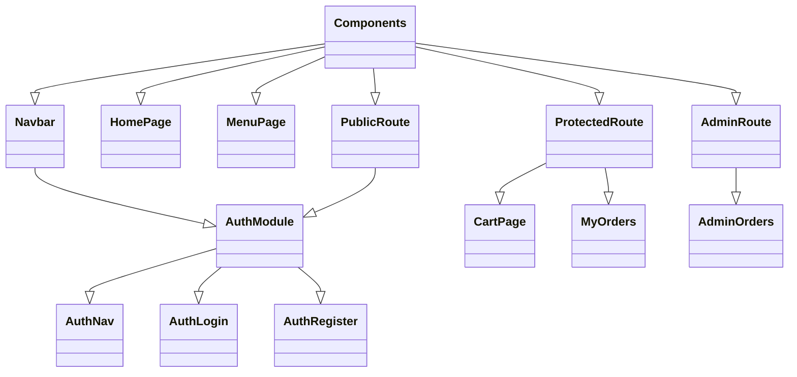
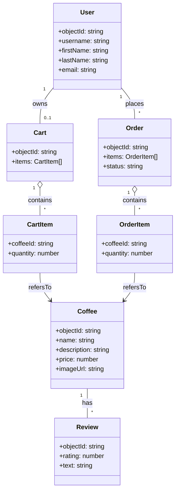

```mermaid
classDiagram
    %% Core Coffee model (Feature 3)
    class Coffee {
      +id: String
      +name: String
      +description: String
      +price: Number
      +imageUrl: String
    }

    %% Cart & Order added (Feature 4)
    class Item {
      +coffeeId: String
      +quantity: Number
    }
    class Cart {
      +id: String
      +items: Item[]
    }
    class Order {
      +id: String
      +items: Item[]
      +status: String
      +createdAt: Date
    }

    %% Authentication & Roles added (Feature 5)
    class User {
      +id: String
      +username: String
      +email: String
      +firstName: String
      +lastName: String
    }
    class Role {
      +name: String
    }

    %% Relationships
    Cart "1" o-- "*" Item    : contains
    Order "1" o-- "*" Item   : contains
    Item "*" --> "1" Coffee  : references
    Cart "1" --> "1" User    : belongsTo
    Order "*" --> "1" User   : belongsTo
    User "*" -- "*" Role     : assigned

```

## UML

## Component Tree Diagram


## Component Tree Diagram

## Component Tree Diagram

## Component Tree Diagram

## Component Tree Diagram

# Coffee Shop App
# CoffeeShop Web App
## Mrinal Sharma Sahil Khandelwal

## Component Tree Diagram

A React application for browsing, ordering, and managing specialty coffees.  
Built with Vite, React 19, Tailwind CSS, React Router v7, and Parse for backend/auth.

---

## 🔍 Overview

- **Browse** a rich menu of coffees (Mocha, Espresso, Latte, Cold Brew, Frappuccino, and more).  
- **Register**, **Login**, and **“Forgot Password”** flows powered by Parse.  
- **Add to Cart** and **Checkout** as a customer; view your **Order History**.  
- **Admin Portal** to view in‑progress orders and mark them “Ready.”  
- Protected routes ensure only logged‑in users see their cart/orders; only admins see admin screens.

---

## 🚀 Getting Started

### Prerequisites

- [Node.js](https://nodejs.org/) ≥16  
- [npm](https://npmjs.com/) or [yarn](https://yarnpkg.com/)  
- A running Parse Server instance (or use a hosted Parse backend)

### Installation

1. **Clone the repo**  
   ```bash
   git clone https://github.com/yourusername/modernWebDev.git
   cd modernWebDev
2. **Install dependencies**
   ```bash
   npm install
3. **Run in development**  
   ```bash
   npm run dev

## Test Accounts & Flow

### Customer
- **Register** a new account at `/register`, or use the test user:
  - **Email:** `test@example.com`
  - **Password:** `qwerty123`

**Flow:**
1. Login at `/login`
2. Visit **Menu** (Home → Menu)
3. Click **Add to Cart** on any coffee
4. Go to **Cart** → **Proceed to Checkout**
5. Visit **My Orders** (`/my-orders`) to see your order marked _In Progress_

### Administrator
- **Login** with admin credentials:
  - **Email:** `mrinalworkus@gmail.com`
  - **Password:** `qwerty123`

**Flow:**
1. After login, navigate to `http://localhost:5173/admin/orders`
2. View all _In Progress_ orders
3. Click **Mark as Ready** to update status

---

## 📂 Diagrams
### Component Architecture

    Components --|> Navbar
    Components --|> HomePage
    Components --|> MenuPage
    Components --|> ProtectedRoute
    Components --|> PublicRoute
    Components --|> AdminRoute
## UML
```mermaid
    Navbar --|> AuthModule
    ProtectedRoute --|> CartPage
    ProtectedRoute --|> MyOrders
    PublicRoute --|> AuthModule
    AuthModule --|> AuthNav
    AuthModule --|> AuthLogin
    AuthModule --|> AuthRegister
    AdminRoute --|> AdminOrders
```
### UML Architecture
```mermaid
classDiagram
    class User {
        +objectId: string
        +username: string
        +firstName: string
        +lastName: string
        +email: string
    }
    class Cart {
        +objectId: string
        +items: CartItem[]
    }
    class Order {
        +objectId: string
        +items: OrderItem[]
        +status: string
    }
    class Coffee {
        +id: string
        +objectId: string
        +name: string
        +description: string
        +price: number
        +reviews: CoffeeReview[]
        +imageUrl: string
    }
    class CartItem {
        +coffeeId: string
        +quantity: number
    }
    class OrderItem {
        +coffeeId: string
        +quantity: number
    }
    class CoffeeReview {
        +id: string
    class Review {
        +objectId: string
        +rating: number
        +text: string
    }
    Coffee "1" o-- "*" CoffeeReview : reviews
```

# React + Vite

This template provides a minimal setup to get React working in Vite with HMR and some ESLint rules.

Currently, two official plugins are available:
- [@vitejs/plugin-react](https://github.com/vitejs/vite-plugin-react/blob/main/packages/plugin-react) uses [Babel](https://babeljs.io/) for Fast Refresh
- [@vitejs/plugin-react-swc](https://github.com/vitejs/vite-plugin-react/blob/main/packages/plugin-react-swc) uses [SWC](https://swc.rs/) for Fast Refresh
    User "1" -- "0..1" Cart : owns
    User "1" -- "*" Order : places
    Cart "1" o-- "*" CartItem : contains
    Order "1" o-- "*" OrderItem : contains
    CartItem --> Coffee : refersTo
    OrderItem --> Coffee : refersTo
    Coffee "1" -- "*" Review : has
